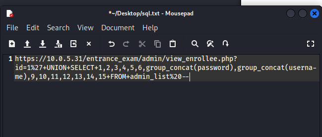

# Exploiting Gloin

This weeks lab was all about exploiting the "Gloin" system. I first located Gloin after using Nmap to search the 10.0.5.x network in our lab environment, and
located it via its outward facing Remote Desktop Protocol (Port 3389). I went to the website to investigate, and found a login page that asked for a reference code.
I spent a week here, frustrated and flabbergasted until a classmate pointed me in the right direction - there is a seperate directory that contains a login page for admins.
Turns out this page is vulnerable to some very simple SQL injections using the old `OR 1=1` trick. Once I was here, I was again stumped. There was nothing else I could
do with the information available on the site. I wasn't able to affect much, although I did add an additional admin member to give myself a practical login avenue. Turns
out, there was an additional page that I originally couldn't access - a php page called 'view_enrollee'. Using SQLmap on this page showed me that there were 15 entries
on the page, allowing me to execute the following SQL injection:

This gave me a hash of the admin's actual password. I plugged this into hashcat and hashcat came back with the decrypted password. Once I obtained that, I was
able to rdp into the box as the Administrator.

#### Reflection
I struggled a lot in this lab - I wouldn't have found the key places to inject sql if it wasn't for talking to classmates about how I was stuck. I feel like
there was an SQL class that I missed during my time here as a student - I don't really understand the language after all the times I've used it. Perhaps I'll
have to spend additional time just learning it. I think the system administrator should probably get hip to SQL injection - once I found the proper places to 
perform it, I got exactly what I needed. Finding a way to sanitize the user input is ESSENTIAL for this kind of stuff
